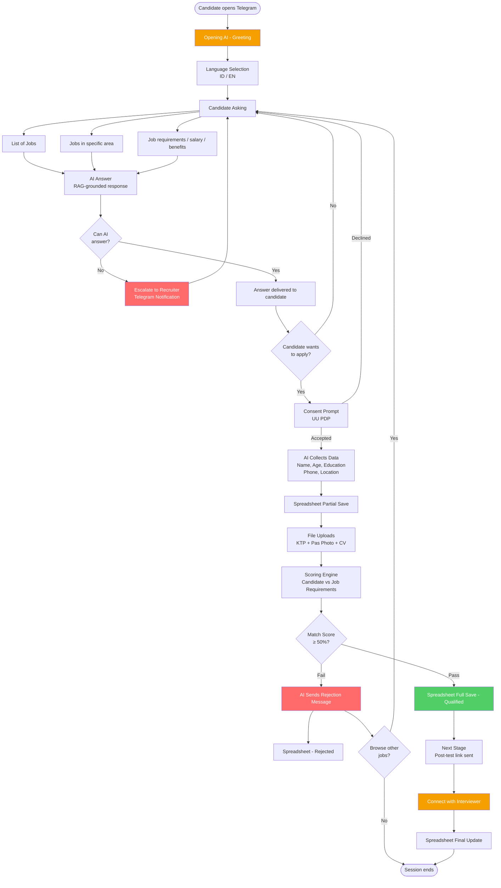

# Product Requirements Document — recruiter-ai

**Author:** Rashauna
**Date:** 2026-03-27

---

## Executive Summary

**recruiter-ai** is a Telegram-based recruitment AI chatbot that automates the full candidate screening pipeline — from job discovery and Q&A to data collection, qualification scoring, and interview routing. Candidates interact entirely within Telegram in Bahasa Indonesia or English; no web forms, portals, or app downloads required.

The system targets Indonesian recruitment operations where candidate drop-off during application is high. By meeting candidates on a platform they already use daily, the bot eliminates friction at every touchpoint. A RAG-powered knowledge base enables accurate answers on job requirements, salary, and benefits without hallucination. Candidates who meet the minimum match threshold (≥50%) advance to the next stage; those who don't receive an automated rejection; unhandled queries are escalated to a recruiter via Telegram notification.

Phase 1 MVP targets a single internal client with Google Sheets as the candidate tracking backend. The architecture is designed to support future migration to Postgres and expansion into a multi-client SaaS product.

### What Makes This Special

Existing recruitment tools are built for recruiters, not candidates. recruiter-ai inverts this — the entire experience is designed around the candidate's journey on a familiar platform. RAG-grounded responses eliminate hallucinated job data, while the inline scoring engine handles 80–90% of candidate interactions autonomously, freeing recruiters to focus only on qualified, engaged candidates.

## Project Classification

- **Project Type:** Conversational AI Backend + Telegram Bot (Bun.js / TypeScript)
- **Domain:** HR Tech / Recruitment
- **Complexity:** Medium-High — RAG pipeline, multi-state conversation FSM, four external integrations (Telegram API, OpenAI, Google Sheets, file storage)
- **Project Context:** Greenfield

## Success Criteria

### User Success

- Candidate completes the full application flow (greeting → Q&A → data collection → scoring → outcome) within a single Telegram session
- Bot accurately answers questions about job requirements, salary, and benefits using RAG-grounded responses — no hallucinated job details
- File uploads (KTP, Pas photo, CV) are received and confirmed within the chat without friction
- Candidate receives clear, immediate feedback at every decision point: advanced, rejected with reason, or escalated to a human
- Language preference (Bahasa Indonesia / English) is respected consistently throughout the entire conversation

### Business Success

- AI handles all candidate interactions autonomously; any query the AI cannot confidently answer triggers an immediate recruiter Telegram notification — no candidate is left without a response
- Recruiters only intervene for escalations and qualified candidates — not for routine Q&A or data collection
- All candidate data recorded in Google Sheets in real-time: partial save on data collection start, full save on qualification, rejected status on failed screening
- MVP live for internal use by **April 2026**

### Measurable Outcomes

- 0 unanswered candidate queries (escalation ensures every question gets a response)
- ≤3s average bot response time for conversational messages
- ≤5s for RAG pipeline responses
- 100% of candidate data captured in Google Sheets before session ends
- MVP delivered by end of April 2026

## System Flow Diagram

## User Journeys

### Journey 1: Budi — The Job Seeker (Happy Path)

Budi, 24, is a fresh graduate in Palangkaraya looking for a warehouse job. He doesn't have a laptop and hates filling forms on mobile browsers.

**Opening:** Budi gets a Telegram link from a friend. He taps it, picks Bahasa Indonesia, and sees a welcome message about available jobs.

**Rising Action:** Budi asks "ada lowongan di Palangkaraya?" — the bot responds with the Sorter Paket job at SPX, listing the role, salary (Pendapatan Harian + BPJS BPU), and requirements (18–45 years, SMA/SMK). He asks "gajinya berapa?" — the bot answers accurately from the knowledge base.

**Climax:** Budi decides to apply. The bot asks: "Apakah kamu ingin melanjutkan proses lamaran?" He says yes. The bot collects his name, age, education, phone, and location through conversation — no form, just chat.

**Resolution:** Budi scores 78% match. He passes. The bot sends him a post-test link and tells him a recruiter will contact him. His data appears in Google Sheets under "Qualified." Budi applied for a job in 5 minutes without leaving Telegram.

**Reveals requirements for:** Language selection, RAG Q&A, confirmation flow, data collection FSM, scoring engine, spreadsheet write (full save), post-test delivery.

---

### Journey 2: Sari — The Unqualified Candidate (Rejection Path)

Sari, 38, applies for the Kurir Motor role in Denpasar but doesn't have SIM C (motorcycle license).

**Opening:** Same entry — bot greets, she picks the Kurir Motor role and asks about requirements.

**Rising Action:** Bot lists requirements including SIM C. Sari says she doesn't have one but still wants to apply. Bot collects her data: age ✓, education ✓, SIM C ✗.

**Climax:** Scoring engine: 35% match — below 50% threshold. Bot sends a polite rejection: "Terima kasih atas minatmu. Sayangnya kamu belum memenuhi syarat untuk posisi ini karena belum memiliki SIM C."

**Resolution:** Sari is recorded in Google Sheets under "Rejected." The bot offers to show her other available jobs — keeping her engaged rather than leaving frustrated.

**Reveals requirements for:** Rejection message flow, spreadsheet write (rejected), re-entry to job listing from rejection.

---

### Journey 3: Reza — The Edge Case (AI Escalation)

Reza, 29, asks a question the bot can't confidently answer: "Apakah bisa kerja remote?" — no remote work data exists in the knowledge base.

**Climax:** The RAG pipeline returns low confidence. Bot responds: "Pertanyaan ini perlu dijawab langsung oleh tim kami. Saya sudah mengirim notifikasi ke staff untuk membantu kamu."

**Resolution:** Recruiter receives a Telegram notification: "Kandidat Reza menanyakan: 'Apakah bisa kerja remote?' — perlu ditangani." Recruiter responds directly to Reza. Reza never feels abandoned.

**Reveals requirements for:** Confidence threshold detection, staff escalation Telegram notification, candidate hold state during escalation.

---

### Journey 4: Alex — The Recruiter (Operations)

Alex manages the Palangkaraya pipeline via Google Sheets and Telegram notifications — he never touches the bot.

**Morning:** Alex opens Google Sheets. Overnight: 8 qualified, 3 rejected, 1 partial (dropped off). He reviews qualified candidates — all fields filled, file uploads confirmed.

**During the day:** He receives 2 Telegram notifications — one escalation question, one candidate flagged for review. He responds directly on Telegram.

**End of day:** He updates the "Final Update" column for candidates who completed interviews.

**Reveals requirements for:** Google Sheets columns matching all data fields, recruiter Telegram notification formatting, partial vs full save distinction, file access for recruiters.

---

### Journey Requirements Summary

| Capability | Revealed By |
| --- | --- |
| Language selection at start | Journey 1, 2, 3 |
| RAG Q&A with job knowledge | Journey 1, 2, 3 |
| Conversation state machine (FSM) | All journeys |
| Candidate data collection (name, age, edu, phone, location) | Journey 1, 2 |
| Scoring engine (match % vs requirements) | Journey 1, 2 |
| Google Sheets: partial save, full save, rejected | Journey 1, 2, 4 |
| File upload (KTP, Pas photo, CV) | Journey 1 |
| Rejection message + re-entry to job listing | Journey 2 |
| AI confidence threshold + escalation | Journey 3 |
| Recruiter Telegram notification | Journey 3, 4 |
| Post-test link delivery | Journey 1 |

## Domain-Specific Requirements

### Compliance & Regulatory

- **UU PDP (Undang-Undang Pelindungan Data Pribadi):** Explicit candidate consent must be obtained and recorded before collecting any personal data (name, age, KTP, photo, CV).
- Candidate data (KTP, photo, CV) is classified as sensitive personal data — stored securely, accessible only to the recruitment team.
- Candidates must be informed of what data is collected and why before providing it.
- Telegram bots are not end-to-end encrypted by default — the system must never request passwords or payment information.

### Integration Requirements

- Telegram Bot API (webhook in production, polling in development)
- OpenAI API (embeddings + GPT-4o for RAG)
- Google Sheets API (read/write candidate records via service account)
- File storage (Telegram file download → local `uploads/` folder for MVP, cloud bucket later)
- Recruiter Telegram notification (bot sends to configured recruiter chat ID or group)

## Innovation & Novel Patterns

### Innovation Areas

**1. Telegram as a Recruitment Channel**
Most Indonesian recruitment uses job portals (Jobstreet, LinkedIn) or manual WhatsApp. Using Telegram as the full recruitment front-end with structured flow, automated screening, and file collection is a novel channel play for this market. No external URL required.

**2. RAG-Grounded Recruitment Q&A**
Standard recruitment chatbots hallucinate or rely on rigid FAQ scripts. A RAG pipeline strictly grounded in the job knowledge base enables accurate free-form answers ("gajinya berapa?", "lokasi kerjanya dimana?") without fabrication.

**3. Maintainable Knowledge Base**
Non-technical staff can add, edit, or remove job listings without touching code. Changes auto-trigger re-indexing. This is a core design requirement — the knowledge base must never require a developer to update job data.

**4. Inline Candidate Scoring**
Combining conversational data collection with a real-time match scoring engine inside a chat flow eliminates manual recruiter pre-screening entirely.

### Candidate Scoring Model (v1 — Placeholder)

Scoring compares candidate data against job sheet requirements. Score is 0–100%.

| Requirement | Weight | Pass Condition | Fail |
| --- | --- | --- | --- |
| Age | 30% | Within job's age range | 0 points |
| Education | 40% | Meets or exceeds minimum level | 0 points |
| SIM / License | 30% | Has required license type | 0 points |
| SIM not required | — | Redistribute 30% equally to Age + Education | — |

**Education level ranking:** `SD < SMP < SMA/SMK < D1 < D2 < D3 < S1 < S2 < S3`

**Threshold:** ≥50% = Pass. <50% = Fail → rejection message.

**Future update:** Add `hard_requirement` flag per job field — if any hard requirement fails, auto-reject regardless of total score. For MVP, the 50% threshold acts as a proxy.

### Market Context

- Indonesian recruitment relies heavily on manual WhatsApp screening — no dominant automated solution exists for this segment
- Telegram bot recruitment is rare; most automation targets web or WhatsApp
- recruiter-ai is a first-mover in Telegram-based AI recruitment in Indonesia, with a clear SaaS path

### Validation Approach

- **RAG accuracy:** Bot Q&A responses must match job knowledge base 100% — no fabricated details
- **Scoring engine:** Test candidates with known profiles; verify match % is deterministic and correct
- **Knowledge base updates:** Add/edit a job record; re-indexing must reflect changes in bot responses within 1 minute
- **Channel fit:** Track candidate completion rate (benchmark: >60% = channel validated)

## Technical Architecture Decisions

### Stack Overview

A Bun.js/TypeScript backend running a Telegram bot as the primary user interface, backed by an OpenAI GPT-powered RAG pipeline using pgvector for job knowledge retrieval, and Google Sheets for candidate tracking.

### Key Technical Decisions

#### Telegram Bot Framework

- Library: **grammy** (TypeScript-first, Bun-compatible, modern session/FSM support)
- Dev mode: Long polling (no HTTPS setup needed locally)
- Production: Webhook via HTTPS endpoint (lower latency, no idle polling)
- Bot token managed via environment variable

#### Conversation State Machine (FSM)

- States: `GREETING` → `LANGUAGE_SELECT` → `CANDIDATE_ASKING` → `CONFIRMATION` → `DATA_COLLECTION` → `SCORING` → `OUTCOME` (pass/fail/escalate)
- Session storage: PostgreSQL table (reuses same Postgres instance as pgvector — no extra infrastructure)
- State persisted per `chat_id` so candidates can resume interrupted sessions

#### RAG Pipeline

- Embedding model: OpenAI `text-embedding-3-small`
- LLM: OpenAI `gpt-4o` for answer generation
- Vector store: pgvector extension on PostgreSQL (hosted via Supabase or Neon for zero infra setup)
- Retrieval strategy: top-k similarity search (k=3) on job knowledge chunks
- Grounding rule: LLM prompt strictly instructs "answer only from retrieved context, do not fabricate"
- Re-indexing triggered automatically on job data change

#### Google Sheets Integration

- Library: `googleapis` (official Google SDK, Bun-compatible)
- Auth: Service account credentials (JSON key stored as env var)
- Write modes: partial save → full save → rejected → final update (manual by recruiter)

#### File Upload Handling

- Candidate sends KTP, Pas photo, CV as Telegram file attachments
- Bot downloads via Telegram File API → stores to local `uploads/` folder (MVP) or cloud bucket (later)
- File path recorded in Google Sheets row for recruiter access
- Max file size: 20MB (Telegram Bot API limit)

#### Recruiter Notification

- Bot sends escalation message to configured recruiter Telegram chat ID or group
- Notification format: candidate name + unanswered question + direct chat link

### Implementation Constraints

- All secrets via `.env` — bot token, OpenAI API key, Google service account, DB connection URL
- Single Bun process for MVP — no separate worker or queue needed
- PostgreSQL used for: pgvector embeddings + conversation session state
- Google Sheets used for: candidate records (recruiter-facing source of truth)
- No external REST API in MVP — all interaction via Telegram

## Project Scoping & Phased Development

### MVP Strategy

**Approach:** Experience MVP — deliver a complete, working candidate journey end-to-end. A fully functional Telegram bot that recruiters can use to screen real candidates from day one.

**Resource:** 1 developer (Bun.js/TypeScript), target April 2026. Earlier delivery is better.

**Phase adjustment:** After Phase 1 is live, Phase 2 priorities will be reviewed and adjusted based on actual usage data and recruiter feedback. Phase 2 and 3 features below are directional, not final.

### Phase 1 — MVP Must-Have Capabilities

- Telegram bot (grammy, Bun.js, TypeScript)
- Bilingual conversation (Bahasa Indonesia + English, candidate selects at start)
- RAG Q&A grounded in job knowledge base (pgvector + GPT-4o)
- Maintainable knowledge base — non-technical staff can update jobs without code changes
- Conversation FSM with session persistence (PostgreSQL)
- UU PDP consent prompt before data collection begins
- Candidate data collection (name, age, education, phone, location)
- Scoring engine v1 (age + education + SIM weights, 50% threshold)
- File upload handling (KTP, Pas photo, CV → local storage)
- Google Sheets integration (partial save, full save, rejected)
- Recruiter escalation via Telegram notification
- Automated rejection message with re-entry to job listing

### Phase 2 — Growth (Post-MVP, subject to Phase 1 learnings)

- Recruiter dashboard (web UI, replaces Google Sheets)
- Postgres as primary candidate database
- Post-test link delivery + video upload in Telegram
- Interview scheduling integration
- Scoring model v2 with `hard_requirement` flags per job field

### Phase 3 — Expansion

- Multi-client SaaS (tenant isolation, billing)
- Analytics dashboard (conversion rates, drop-off, recruiter performance)
- Automated interview scheduling with calendar sync
- AI-powered video screening analysis

### Risk Register

| Risk | Mitigation |
| --- | --- |
| 4 integrations in 1 month | Build and test each in isolation; spike RAG pipeline in week 1 |
| pgvector setup complexity | Use Supabase or Neon (hosted Postgres + pgvector, no infra setup) |
| Candidates unfamiliar with bot application | Internal pilot with 10–20 real candidates before wider rollout |
| Solo dev, tight deadline | Defer post-test delivery to Phase 2 if needed; file upload to local folder only |
| Scope creep | Strict MVP gate: anything not in Phase 1 list is Phase 2 |
| Candidate shares KTP in wrong state | Bot explicitly requests files only at the correct FSM state |
| AI hallucinates job data | RAG strictly grounded; LLM instructed not to fabricate |
| Google Sheets accidentally edited | Protect sheet with role-based access |
| Candidate data leak | Files stored in private location, not embedded in Sheets |
| RAG returns outdated job data | Knowledge base re-indexing on every data change |

## Functional Requirements

### Conversation & Onboarding

- FR1: A candidate can initiate a conversation with the bot via Telegram
- FR2: A candidate can select their preferred language (Bahasa Indonesia or English) at the start of a session
- FR3: A candidate can receive a greeting message that explains what the bot does
- FR4: A candidate can resume an interrupted session without restarting from scratch
- FR5: A candidate can receive explicit notification of what personal data will be collected and why, and provide consent before any data is gathered

### Job Discovery & Q&A

- FR6: A candidate can ask free-form questions about available jobs in natural language
- FR7: A candidate can ask about job requirements (age, education, license, location) and receive accurate answers
- FR8: A candidate can ask about compensation and benefits for a specific job and receive accurate answers
- FR9: A candidate can request a list of all available jobs
- FR10: A candidate can filter or ask about jobs available in a specific area
- FR11: A candidate can receive answers grounded only in the job knowledge base (no fabricated details)
- FR12: A candidate whose question cannot be answered by the AI can be escalated to a human recruiter without leaving the chat

### Candidate Application

- FR13: A candidate can confirm their intent to apply for a specific job
- FR14: A candidate can provide their personal data (name, age, education level, phone number, location) through conversational prompts
- FR15: A candidate can upload their KTP document as a file attachment within the Telegram chat
- FR16: A candidate can upload their Pas photo as a file attachment within the Telegram chat
- FR17: A candidate can upload their CV as a file attachment within the Telegram chat
- FR18: A candidate can receive confirmation that each uploaded file was received successfully

### Candidate Screening & Outcome

- FR19: The system can calculate a match score for a candidate against a specific job's requirements
- FR20: A candidate who meets the minimum match threshold can be automatically advanced to the next recruitment stage
- FR21: A candidate who does not meet the minimum match threshold can receive an automated, polite rejection message explaining why
- FR22: A rejected candidate can be offered the option to browse other available jobs
- FR23: A candidate who passes screening can receive next-step instructions (e.g. post-test link)

### Knowledge Base Management

- FR24: An admin can add a new job listing to the knowledge base without modifying code
- FR25: An admin can edit an existing job listing's details (requirements, salary, description) without modifying code
- FR26: An admin can remove a job listing from the knowledge base without modifying code
- FR27: The system can re-index the knowledge base automatically when job data changes

### Recruiter Operations

- FR28: A recruiter can receive a Telegram notification when the AI cannot handle a candidate's query
- FR29: A recruiter can view all candidate records (name, age, education, phone, location, status, file references) in Google Sheets
- FR30: The system can save candidate data to Google Sheets as a partial record when data collection begins
- FR31: The system can update a candidate's Google Sheets record to "qualified" with full data when they pass screening
- FR32: The system can update a candidate's Google Sheets record to "rejected" when they fail screening
- FR33: A recruiter can manually update a candidate's record in Google Sheets after interview completion

### Data & Session Management

- FR34: The system can persist a candidate's conversation state so sessions survive bot restarts or connection drops
- FR35: Uploaded candidate files can be stored securely and accessed only by authorized recruiters

## Non-Functional Requirements

### Performance

- NFR1: Bot must respond to standard conversational messages within ≤3 seconds under normal load
- NFR2: RAG pipeline (embedding lookup + GPT-4o generation) must complete within ≤5 seconds per query
- NFR3: Google Sheets write operations must complete within ≤3 seconds without blocking the conversation flow
- NFR4: File upload acknowledgement must be sent to the candidate within ≤5 seconds of receiving the file

### Security

- NFR5: All candidate personal data must be stored in a system accessible only to authorized recruiters
- NFR6: Uploaded files (KTP, Pas photo, CV) must be stored with access controls — not publicly accessible via URL
- NFR7: All API credentials must be stored as environment variables — never hardcoded or committed to version control
- NFR8: Candidate consent must be recorded before any personal data is collected (UU PDP compliance)
- NFR9: The system must not request or store passwords, payment information, or any data beyond what is required for recruitment screening

### Scalability

- NFR10: The system must support at least 50 concurrent candidate sessions without response time degradation (MVP baseline)
- NFR11: Knowledge base re-indexing must not block active candidate sessions
- NFR12: The architecture must support future migration from Google Sheets to Postgres without a full application rewrite

### Reliability

- NFR13: Conversation session state must be persisted so no candidate loses progress due to a bot restart or network interruption
- NFR14: If the Google Sheets API is unavailable, the system must queue the write and retry — candidate data must not be silently lost
- NFR15: If the OpenAI API is unavailable, the bot must notify the candidate and escalate to a recruiter rather than returning an empty or error response

### Integration

- NFR16: Google Sheets integration must use a service account with least-privilege access (write to candidate sheet only)
- NFR17: Telegram webhook must be configured with HTTPS and a secret token to prevent unauthorized message injection
- NFR18: All external API calls (OpenAI, Google, Telegram) must have a timeout of ≤10 seconds with graceful error handling
